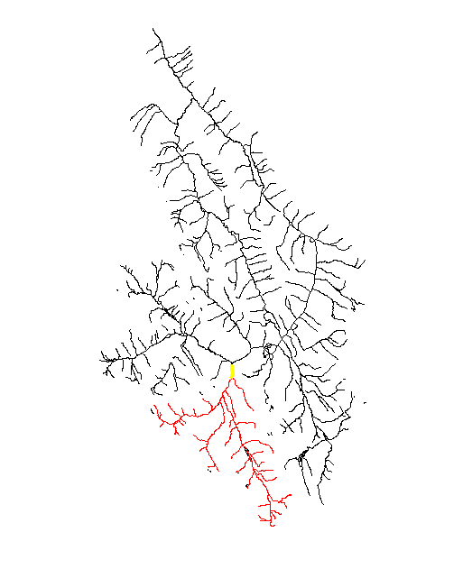

# canadaNHN - Canadian National Hydro Network R-package

<!-- badges: start -->
<!-- badges: end -->

The Canadian National Hydrographic Network R-package is a collection of tools and functions designed to support the stream network analyses and watershed delineations from the [Canadian NHN](https://www.nrcan.gc.ca/science-and-data/science-and-research/earth-sciences/geography/topographic-information/geobase-surface-water-program-geeau/national-hydrographic-network/21361). Key functions include upstream and downstream network delineations from junction points as well as pseudo-watershed delineation based on RCA polygons.

## Package Contributors:
Contributors include:
-   [Matthew Bayly](https://github.com/mattjbayly)

## Features
- Upstream streamline network delineation from the NHN network
- Downstream streamline network delineation from the NHN network
- pseudo-RCA (each contributing areas) polygon generation
- Watershed delineation


## Installation

The easiest way to install the `canadaNHN` package is from within the [RStudio IDE](https://www.rstudio.com/products/rstudio/download/) using `remotes::install_github()`. At this time the package has not been published to CRAN so the default `install.packages()` will not work. Instead use remotes (or devtools) to install the packge directly from GitHub:
``` r
# You may need to install remotes
library(remotes)
remotes::install_github("mattjbayly/canadaNHN")
```

## Usage

### Trace downstream flow lines from a point

Trace the downstream flow path from an NHN junction nid (layer: NHN_HN_HYDROJUNCT_0). Inputs include the streamline vector layer (NHN_HN_NLFLOW_1) and a target junction nid as `jnid`.

``` r
# Load example data
filename_strm <- system.file("extdata", "NHN_HN_NLFLOW_1.gpkg", package = "canadaNHN")
strm <- sf::st_read(paste0(filename_strm), layer="NHN_HN_NLFLOW_1")
strm <- sf::st_zm(strm)

#Trace downstream path
target_junction_nid <- "484667c6025244219cfa5e5ee994715b"

ds_lines <- get_downstream_lines(strm = strm,
	jnid = target_junction_nid,
	ds_sreach = 1000)
	
plot(sf::st_geometry(strm))
plot(sf::st_geometry(ds_lines), add = TRUE, col = "red")
out_sl <- strm[strm$fromJunction == target_junction_nid, ]
plot(sf::st_geometry(out_sl), add = TRUE, col = "yellow", lwd = 4)

```


### Trace upstream flow lines from a point

Trace all upstream flow paths from an NHN junction nid (layer: NHN_HN_HYDROJUNCT_0). Inputs include the streamline vector layer (NHN_HN_NLFLOW_1) and a target junction nid as `jnid`.

``` r
# Load example data
filename_strm <- system.file("extdata", "NHN_HN_NLFLOW_1.gpkg", package = "canadaNHN")
strm <- sf::st_read(paste0(filename_strm), layer="NHN_HN_NLFLOW_1")
strm <- sf::st_zm(strm)

#Trace downstream path
target_junction_nid <- "c2ad6151e60a49dbabcb59d85eda4cba"

us_lines <- get_upstream_lines(strm = strm,
	jnid = target_junction_nid,
	us_limit = 1000)
	
plot(sf::st_geometry(strm))
plot(sf::st_geometry(us_lines), add = TRUE, col = "red")
out_sl <- strm[strm$fromJunction == target_junction_nid, ]
plot(sf::st_geometry(out_sl), add = TRUE, col = "yellow", lwd = 4)

```



### Generate small pseudo-RCA polygons

Reach contributing area (or RCA) polygons are used are pseudo-subunits to help delineate drainage basin boundaries.

``` r
# Load example data
filename_strm <- system.file("extdata", "NHN_HN_NLFLOW_1.gpkg", package = "canadaNHN")
strm <- sf::st_read(paste0(filename_strm), layer="NHN_HN_NLFLOW_1")
strm <- sf::st_zm(strm) # Drop z geometry

# Convert to local UTM zone
strm <- sf::st_transform(strm, util_utm_zone(strm))

# Load basin boundary
filename_basin <- system.file("extdata", "NHN_WORKUNIT_LIMIT_2.gpkg", package = "canadaNHN")
basin <- sf::st_read(paste0(filename_basin), layer="NHN_WORKUNIT_LIMIT_2")


# Recommended step: Run get_upstream_lines() first with the basin outlet this prevents network topology issues with isolated segments.
# NHN Working unit outlet junction ID
outlet_junction <- '310665e2e3dd4738b26b031a85d2bb19'
strm_fix <- get_upstream_lines(strm = strm, jnid = outlet_junction)


# RCA Polygons from NHN network
rca <- generate_rca_polygons(basin = basin, strm = strm_fix, pt_density_m = 50)

plot(sf::st_geometry(rca), col = "#e0d7ab", border = "#f7f5e9")
plot(sf::st_geometry(strm), col = "#395387", add = TRUE)

```


### Delineate Upstream Drainage Basin

Delineate upstream drainage basin with reach contributing area (RCA) polygons (from previous step). Note that this methodology does not create perfect watershed boundaries and may not work well in steep terrain.

``` r
# Identify a target NHN junction ID for upstream delineation
target_junction <- "c2ad6151e60a49dbabcb59d85eda4cba"

watershed <- get_upstream_polygons(
      jnid = target_junction,
      strm = strm,
      rca = rca, # from previous step (above)...
      dissolve = TRUE)

# View result
plot(sf::st_geometry(watershed), col = "pink", add = TRUE)
out_sl <- strm[strm$fromJunction == target_junction, ]
plot(sf::st_geometry(strm), col = "#395387", add = TRUE)
plot(sf::st_geometry(out_sl), add = TRUE, col = "yellow", lwd = 3)
``` 


## Code of Conduct

Please note that the `canadaNHN` package is released with a [Contributor Code of Conduct](https://pkgs.rstudio.com/rmarkdown/CODE_OF_CONDUCT.html). By contributing to this project, you agree to abide by its terms.
